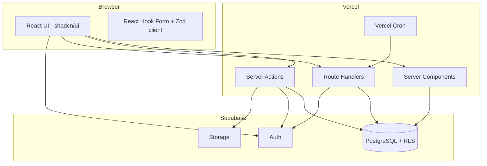

# DM Agree CRM — System Architecture

**Status:** Planning only (no application code in repository yet)  
**Last updated:** 2026-10-02

---

## 1. Executive summary

DM Agree CRM is a single-repository, full-stack internal CRM built on **Next.js (App Router)** with **Supabase** (PostgreSQL, Auth, Storage) and deployed on **Vercel**. All business logic, authorization, and data mutations run on the server (Server Actions and Route Handlers). The browser never receives the Supabase **service role** key.

The repository is currently **empty**; this document defines the target architecture before Phase 1 implementation.

---

## 2. Architecture principles

| Principle | Decision |
|-----------|----------|
| Monolith repo | One Next.js app; no separate Express/API server |
| Server-first security | Every mutation validates session + RBAC on the server |
| UI permission gates | Hide/disable controls for UX only; not a security boundary |
| Normalized data | Customers, products, inquiries, follow-ups, reminders as relational entities |
| Append-only history | Follow-ups, activity logs, and purchase history are never overwritten |
| Server-side lists | Pagination, search, and filters run in PostgreSQL via server code |
| Timezone | **Asia/Kolkata** for reminders, “today”, and cron boundaries |
| Future attachments | Supabase Storage + metadata table; no Vercel filesystem |

---

## 3. High-level diagram



---

## 4. Next.js ↔ Supabase communication

### 4.1 Supabase client variants

| Client | Where | Key | Purpose |
|--------|-------|-----|---------|
| **Browser client** | Client Components | `NEXT_PUBLIC_SUPABASE_URL`, `NEXT_PUBLIC_SUPABASE_ANON_KEY` | Auth session refresh, optional realtime; no privileged ops |
| **Server user client** | Server Components, Server Actions, Route Handlers | Same anon key + **cookies** (SSR package) | Queries/mutations **as the logged-in user**; RLS applies |
| **Admin client** | Server only (never bundled to client) | `SUPABASE_SERVICE_ROLE_KEY` | Admin user provisioning, cron, rare bypass when RLS cannot express rule |

**Environment variable usage:**

| Variable | Exposure | Usage |
|----------|----------|--------|
| `NEXT_PUBLIC_SUPABASE_URL` | Public | All clients |
| `NEXT_PUBLIC_SUPABASE_ANON_KEY` | Public | Browser + server user client |
| `SUPABASE_SERVICE_ROLE_KEY` | **Server only** | User create/disable, password admin reset, cron notification fan-out if needed |
| `CRON_SECRET` | Server only | Authenticate Vercel Cron → Route Handler |
| `NEXT_PUBLIC_APP_URL` | Public | Auth redirect URLs, email links |

### 4.2 Recommended data access pattern

1. **Default:** Server Action / Server Component uses **server user client** → PostgreSQL with RLS as defense-in-depth.
2. **Authorization:** Before any mutation, application code calls `assertPermission(session, 'module.action')` (loads permissions from DB or session cache).
3. **Admin client:** Only for:
   - Creating Supabase Auth user when CRM admin adds a user
   - Updating auth email / sending recovery
   - Disabling auth user when CRM profile is deactivated
   - Cron jobs that must run without a user session (prefer SECURITY DEFINER SQL functions invoked with service role for minimal surface)

Avoid using the service role for routine CRUD that can run under the user JWT.

---

## 5. Authentication architecture

### 5.1 Identity model

```
auth.users (Supabase managed)
    │
    │ 1:1 PK/FK
    ▼
profiles (CRM user)
    │
    ├── role_id → roles
    └── is_active, display_name, ...
```

- **Passwords** exist only in Supabase Auth (`auth.users`). The CRM `profiles` table stores **no password fields**.
- **Login:** Email + password via `signInWithPassword` (client or server-assisted flow).
- **Session:** Supabase SSR cookie pattern (`@supabase/ssr`); middleware refreshes session.
- **Inactive users:** `profiles.is_active = false` → after successful auth, server/middleware signs user out and shows “account inactive”. Optionally call Admin API to ban user in Auth for stronger lockout.
- **Password reset:** Supabase `resetPasswordForEmail` + `/auth/callback` route for update password.

### 5.2 Route protection

| Layer | Responsibility |
|-------|----------------|
| **Middleware** | Refresh session; redirect unauthenticated users from `(app)` routes to `/login` |
| **Layout (server)** | Load profile + role; redirect if inactive or missing profile |
| **Server Actions / handlers** | Re-validate session + permissions on every call |

Public routes: `/login`, `/auth/callback`, `/auth/reset-password`, static assets.

---

## 6. RBAC architecture (summary)

Detailed permission matrix: see [RBAC_DESIGN.md](./RBAC_DESIGN.md).

- **Enforcement order:** Session valid → profile active → permission check → input validation → database operation.
- **UI:** `usePermissions()` or server-passed permission set for conditional rendering.
- **Server:** Shared `authorize(permission: PermissionCode)` used by all actions.
- **RLS:** Policies aligned with “authenticated + active profile”; fine-grained permission checks remain in application layer (RLS alone is insufficient for granular RBAC without JWT custom claims).

Optional Phase 15 enhancement: sync permission codes into JWT `app_metadata` on login for RLS helper functions (size limits apply).

---

## 7. Application routing (App Router)

```
app/
  (auth)/
    login/
    auth/callback/
    reset-password/
  (app)/                    # Protected shell: sidebar + topbar
    layout.tsx
    dashboard/
    inquiries/
    reminders/
    products/
    customers/
    customers/[customerId]/   # Customer 360°
    follow-ups/
    roles/
    users/
    profile/
    notifications/          # Optional full page; bell is global
  api/
    cron/reminders/
    export/...              # Optional streaming exports
```

**Customer 360°** is the canonical detail view at `/customers/[customerId]`. Other modules link here (customers list, inquiries, follow-ups, reminders).

---

## 8. Server Actions vs Route Handlers

| Use case | Mechanism |
|----------|-----------|
| Form CRUD, mutations | Server Actions |
| File upload (Excel) | Server Action with `FormData` or Route Handler for large streams |
| Excel export download | Route Handler (streaming) or Server Action returning signed URL |
| Vercel Cron | Route Handler `GET /api/cron/reminders` + `CRON_SECRET` |
| Webhooks (future) | Route Handlers |

---

## 9. Search, filter, and pagination

- **URL-driven state** for list pages: `?search=&page=&sort=&filters...`
- **Server Components** read `searchParams`, call repository functions with Zod-validated query DTOs.
- **Debounced search** on client updates URL (nuqs or manual `useRouter`).
- **Indexes** on filtered columns (see DATABASE_DESIGN.md).

---

## 10. Excel import/export (architecture)

Shared library under `src/lib/excel/`:

- `createTemplate(columns)`
- `parseWorkbook(buffer, schema)`
- `validateRows(rows, rules)` → `{ valid, errorsByRow, duplicates }`
- Module-specific mappers: `inquiryImportMapper`, `customerImportMapper`

Import flow: Download template → Upload → Server parse → Preview page (session-staged or temp table) → Confirm import → Transactional insert + activity log.

Export: Server builds workbook from **current filtered query** (same filters as UI).

---

## 11. Reminders and notifications

- **Reminder status** computed in SQL or app layer from `remind_at` (Asia/Kolkata) + `completed_at`.
- **Cron (Vercel):** Daily/hourly job marks due reminders and creates **notification** rows idempotently.
- **Idempotency:** Unique constraint on `(user_id, reminder_id, notification_kind, local_date)` or `dedupe_key` column.
- **In-app:** `notifications` table; bell polls or realtime subscription; mark read / mark all read.

See IMPLEMENTATION_PLAN.md Phases 10–11.

---

## 12. Activity logging

Central `activity_logs` table; written from Server Actions after successful mutations (same transaction where possible).

Customer 360° timeline reads from `activity_logs` filtered by `customer_id` (denormalized on log row for query efficiency) and related entity IDs.

---

## 13. File attachments (future-ready)

- Bucket: `crm-attachments` (private)
- Table: `attachments` (entity_type, entity_id, storage_path, mime, size, uploaded_by)
- Upload: Server Action generates signed upload URL or server-side upload with service role
- Download: Short-lived signed URL after permission check

---

## 14. Recommended folder structure

```
src/
  app/                      # Routes, layouts, loading/error UI
  components/
    ui/                     # shadcn primitives
    layout/                 # Sidebar, Topbar, AppShell
    shared/                 # DataTable, Filters, ConfirmDialog
  features/                 # Domain modules (colocated UI + hooks)
    dashboard/
    inquiries/
    customers/
    customer-360/
    ...
  actions/                  # Server Actions (thin) → services
  lib/
    supabase/               # browser, server, admin clients
    auth/                   # session helpers, middleware utils
    rbac/                   # authorize(), permission constants
    excel/
    datetime/               # Asia/Kolkata helpers
    db/                     # Typed query builders / repositories
  validations/              # Zod schemas per module
  types/                    # DB types, DTOs
  hooks/                    # Client hooks (permissions, debounce)
supabase/
  migrations/               # SQL migrations
  seed.sql                  # permissions, default admin role (no prod passwords)
docs/                       # Planning & runbooks
```

**Responsibilities:**

- `features/*`: Page-specific components and client logic; keeps `app/` routes thin.
- `actions/*`: Entry points; validate + authorize + call services.
- `lib/db/*`: Single place for SQL/Supabase queries (testable, avoids N+1).
- `validations/*`: Shared Zod schemas for forms and API query params.

---

## 15. UI/UX architecture

- **Shell:** Collapsible sidebar (8 main modules), top bar with global search (phase 2+), notification bell, profile menu.
- **Patterns:** List → Detail drawer or page; Customer 360° as full page; modals for quick create; destructive actions via AlertDialog.
- **Tables:** Shared DataTable with server pagination, column sort, filter chips.
- **Feedback:** Sonner toasts, skeleton loaders, empty states with primary CTA.
- **Reference:** Handwritten CRM structure (provided separately) maps 1:1 to nav items above.

---

## 16. Performance strategy

- Paginate all major lists (default page size 25–50).
- Customer 360°: **one orchestrated server load** — parallel queries or single RPC returning JSON sections.
- Avoid loading full follow-up history client-side; paginate timeline sections if large.
- Database indexes on FKs, `mobile_normalized`, date columns, `(assigned_user_id, status)`.
- React Server Components for read-heavy views; Client Components only for interactivity.

---

## 17. Security summary

See IMPLEMENTATION_PLAN.md Phase 15 and RBAC_DESIGN.md.

- Zod on all inputs; parameterized queries via Supabase client.
- CSRF: Server Actions use Next.js built-in protection; Route Handlers use secrets for cron.
- XSS: React escaping; sanitize rich text if notes ever allow HTML (default: plain text).
- Rate limit login and import endpoints (Vercel middleware or Upstash — decision required).
- Audit via `activity_logs` + Auth logs in Supabase dashboard.

---

## 18. Related documents

| Document | Contents |
|----------|----------|
| [DATABASE_DESIGN.md](./DATABASE_DESIGN.md) | Schema, indexes, relationships |
| [RBAC_DESIGN.md](./RBAC_DESIGN.md) | Permissions, roles, enforcement |
| [CUSTOMER_360_DESIGN.md](./CUSTOMER_360_DESIGN.md) | 360 page sections and queries |
| [DEPLOYMENT_PLAN.md](./DEPLOYMENT_PLAN.md) | Vercel, Supabase, env, cron |
| [IMPLEMENTATION_PLAN.md](./IMPLEMENTATION_PLAN.md) | Phased delivery, acceptance criteria |
