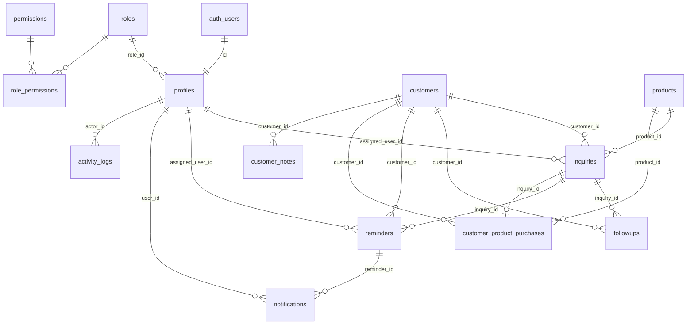

# DM Agree CRM — Database Design

**Status:** Phase 2 schema implemented in `supabase/migrations`  
**DBMS:** PostgreSQL (Supabase)  
**Last updated:** 2026-10-02

---

## 1. Design goals

- Normalize customers and products; avoid duplicating master data on every inquiry.
- Preserve **historical truth** (inquiries retain context even if product deactivated or customer renamed).
- Support **Customer 360°** with efficient queries and clear FK graph.
- Enable **granular RBAC** without storing passwords in app tables.
- Support **soft delete** where recovery/audit matters; hard delete only where safe.

---

## 2. Entity relationship overview

---

## 3. Enumerations (PostgreSQL ENUM or text + CHECK)

| Enum | Values |
|------|--------|
| `customer_type` | `farmer`, `dealer`, `distributor`, `other` (extend via migration) |
| `reminder_status` | Stored: `pending`, `completed`, `cancelled`; computed UI: overdue/today/upcoming |
| `notification_kind` | `reminder_today`, `reminder_overdue`, `reminder_upcoming`, `system` |
| `activity_action` | See Activity section |
| `entity_type` | `customer`, `inquiry`, `followup`, `reminder`, `product`, `user`, `role` |

**Recommendation:** Use `text` + CHECK constraints for easier migrations unless enum stability is guaranteed.

---

## 4. Table specifications

### 4.1 `permissions`

| Column | Type | Constraints |
|--------|------|-------------|
| id | uuid | PK, default gen_random_uuid() |
| code | text | NOT NULL, UNIQUE (e.g. `inquiry.create`) |
| module | text | NOT NULL |
| description | text | nullable |
| created_at | timestamptz | NOT NULL default now() |

**Indexes:** UNIQUE on `code`; index on `module`.

---

### 4.2 `roles`

| Column | Type | Constraints |
|--------|------|-------------|
| id | uuid | PK |
| name | text | NOT NULL, UNIQUE |
| description | text | nullable |
| is_system | boolean | NOT NULL default false |
| created_at | timestamptz | NOT NULL |
| updated_at | timestamptz | NOT NULL |
| deleted_at | timestamptz | nullable (soft delete) |

**Rules:** System roles (e.g. Administrator) cannot be deleted. Last admin protection enforced in app layer + optional DB trigger.

---

### 4.3 `role_permissions`

| Column | Type | Constraints |
|--------|------|-------------|
| role_id | uuid | PK part, FK → roles |
| permission_id | uuid | PK part, FK → permissions |
| created_at | timestamptz | NOT NULL |

**Indexes:** PK (role_id, permission_id); index on permission_id.

---

### 4.4 `profiles` (CRM user; links to Supabase Auth)

| Column | Type | Constraints |
|--------|------|-------------|
| id | uuid | PK, FK → auth.users(id) ON DELETE CASCADE |
| display_name | text | NOT NULL |
| email | text | NOT NULL (synced from auth; unique) |
| role_id | uuid | NOT NULL FK → roles |
| is_active | boolean | NOT NULL default true |
| created_at | timestamptz | NOT NULL |
| updated_at | timestamptz | NOT NULL |
| deleted_at | timestamptz | nullable |

**Indexes:** UNIQUE(email); index on (role_id); index on (is_active) WHERE deleted_at IS NULL.

**Note:** No password column.

---

### 4.5 `products`

| Column | Type | Constraints |
|--------|------|-------------|
| id | uuid | PK |
| name | text | NOT NULL |
| is_active | boolean | NOT NULL default true |
| created_at | timestamptz | NOT NULL |
| updated_at | timestamptz | NOT NULL |
| deleted_at | timestamptz | nullable |

**Indexes:** UNIQUE lower(name) where deleted_at IS NULL; index on (is_active).

**Behavior:** Inactive products hidden from new inquiry/customer pickers; historical FKs remain valid.

---

### 4.6 `customers`

| Column | Type | Constraints |
|--------|------|-------------|
| id | uuid | PK |
| name | text | NOT NULL |
| mobile | text | NOT NULL (display format) |
| mobile_normalized | text | NOT NULL (digits only, canonical) |
| customer_type | text | nullable |
| primary_product_id | uuid | nullable FK → products (latest/primary interest) |
| product_purchased | boolean | NOT NULL default false (summary flag) |
| follow_up_required | boolean | NOT NULL default false |
| notes | text | nullable (legacy/summary; see customer_notes) |
| assigned_user_id | uuid | nullable FK → profiles |
| created_by | uuid | nullable FK → profiles |
| created_at | timestamptz | NOT NULL |
| updated_at | timestamptz | NOT NULL |
| deleted_at | timestamptz | nullable |

**Indexes:**

- UNIQUE (mobile_normalized) WHERE deleted_at IS NULL — **duplicate detection**
- index on (name) using gin/trgm for search (pg_trgm extension)
- index on (primary_product_id), (product_purchased), (follow_up_required)
- index on (assigned_user_id)

**Duplicate policy:** One active customer per normalized mobile; import/update flows merge or skip explicitly.

---

### 4.7 `inquiries`

| Column | Type | Constraints |
|--------|------|-------------|
| id | uuid | PK |
| inquiry_date | date | NOT NULL |
| customer_id | uuid | NOT NULL FK → customers |
| customer_type | text | nullable (snapshot or synced from customer) |
| product_id | uuid | NOT NULL FK → products |
| product_purchased | boolean | NOT NULL default false |
| remarks | text | nullable |
| assigned_user_id | uuid | nullable FK → profiles |
| created_by | uuid | NOT NULL FK → profiles |
| created_at | timestamptz | NOT NULL |
| updated_at | timestamptz | NOT NULL |
| deleted_at | timestamptz | nullable |

**Optional denormalized snapshots** (if customer/product rename should not alter historical display):

- `customer_name_snapshot`, `mobile_snapshot`, `product_name_snapshot` — populated on insert.

**Why FKs:**

| FK | Rationale |
|----|-----------|
| `customer_id` | Single customer master; powers 360° and duplicate mobile logic |
| `product_id` | Reporting, filters, active product rules |
| `assigned_user_id` | Ownership, dashboard “my inquiries”, filters |

**Indexes:** (inquiry_date DESC), (customer_id), (product_id), (product_purchased), (assigned_user_id), composite (inquiry_date, customer_id).

**Follow-ups:** Not embedded — separate `followups` table.

---

### 4.8 `followups`

| Column | Type | Constraints |
|--------|------|-------------|
| id | uuid | PK |
| customer_id | uuid | NOT NULL FK → customers |
| inquiry_id | uuid | nullable FK → inquiries |
| followup_date | date | NOT NULL |
| notes | text | NOT NULL |
| created_by | uuid | NOT NULL FK → profiles |
| created_at | timestamptz | NOT NULL |
| updated_at | timestamptz | NOT NULL |
| deleted_at | timestamptz | nullable |

**Indexes:** (customer_id, followup_date DESC), (inquiry_id), (created_by), (followup_date).

**Rule:** Updates edit row metadata; **never** reuse row for a new conversation — always INSERT for new follow-up.

---

### 4.9 `reminders`

| Column | Type | Constraints |
|--------|------|-------------|
| id | uuid | PK |
| title | text | NOT NULL |
| customer_id | uuid | NOT NULL FK → customers |
| inquiry_id | uuid | nullable FK → inquiries |
| remind_at | timestamptz | NOT NULL (stored UTC; displayed Asia/Kolkata) |
| notes | text | nullable |
| assigned_user_id | uuid | NOT NULL FK → profiles |
| completed_at | timestamptz | nullable |
| snoozed_until | timestamptz | nullable |
| cancelled_at | timestamptz | nullable |
| created_by | uuid | NOT NULL FK → profiles |
| created_at | timestamptz | NOT NULL |
| updated_at | timestamptz | NOT NULL |
| deleted_at | timestamptz | nullable |

**Status (computed):**

- `completed` if `completed_at` IS NOT NULL
- Else if `remind_at` < start_of_today_IST → overdue
- Else if same local day → today
- Else upcoming

**Indexes:** (assigned_user_id, remind_at), (customer_id), partial WHERE completed_at IS NULL.

---

### 4.10 `customer_product_purchases`

Supports **Purchased Products** on Customer 360° without overloading `customers.product_purchased` alone.

| Column | Type | Constraints |
|--------|------|-------------|
| id | uuid | PK |
| customer_id | uuid | NOT NULL FK → customers |
| product_id | uuid | NOT NULL FK → products |
| inquiry_id | uuid | nullable FK → inquiries |
| purchased_at | date | nullable |
| is_purchased | boolean | NOT NULL default true |
| created_at | timestamptz | NOT NULL |
| updated_at | timestamptz | NOT NULL |

**Indexes:** (customer_id), UNIQUE (customer_id, product_id, inquiry_id) where inquiry_id IS NOT NULL (optional business rule).

**Sync rule:** When inquiry `product_purchased` flips to true, upsert purchase row and set `customers.product_purchased = true` if any purchase exists.

---

### 4.11 `customer_notes`

| Column | Type | Constraints |
|--------|------|-------------|
| id | uuid | PK |
| customer_id | uuid | NOT NULL FK → customers |
| body | text | NOT NULL |
| created_by | uuid | NOT NULL FK → profiles |
| created_at | timestamptz | NOT NULL |
| updated_at | timestamptz | nullable |
| deleted_at | timestamptz | nullable |

**Rationale:** Scalable notes vs single `customers.notes` field (keep `customers.notes` as optional summary or deprecate in UI later).

---

### 4.12 `notifications`

| Column | Type | Constraints |
|--------|------|-------------|
| id | uuid | PK |
| user_id | uuid | NOT NULL FK → profiles |
| reminder_id | uuid | nullable FK → reminders |
| kind | text | NOT NULL |
| title | text | NOT NULL |
| body | text | nullable |
| dedupe_key | text | NOT NULL UNIQUE |
| read_at | timestamptz | nullable |
| created_at | timestamptz | NOT NULL |

**dedupe_key example:** `reminder:{id}:overdue:2026-10-02` — prevents duplicate cron notifications.

**Indexes:** (user_id, read_at), (user_id, created_at DESC).

---

### 4.13 `activity_logs`

| Column | Type | Constraints |
|--------|------|-------------|
| id | uuid | PK |
| actor_id | uuid | NOT NULL FK → profiles |
| action | text | NOT NULL |
| module | text | NOT NULL |
| entity_type | text | NOT NULL |
| entity_id | uuid | NOT NULL |
| customer_id | uuid | nullable FK → customers (for 360 timeline) |
| metadata | jsonb | NOT NULL default '{}' |
| created_at | timestamptz | NOT NULL |

**Indexes:** (customer_id, created_at DESC), (entity_type, entity_id), (actor_id, created_at DESC), (module, created_at DESC).

**Example actions:** `INQUIRY_CREATED`, `CUSTOMER_UPDATED`, `REMINDER_COMPLETED`, `USER_CREATED`, `ROLE_UPDATED`, `EXCEL_IMPORT_INQUIRIES`.

---

### 4.14 `attachments` (future)

| Column | Type | Constraints |
|--------|------|-------------|
| id | uuid | PK |
| entity_type | text | NOT NULL |
| entity_id | uuid | NOT NULL |
| bucket | text | NOT NULL |
| storage_path | text | NOT NULL |
| file_name | text | NOT NULL |
| mime_type | text | NOT NULL |
| size_bytes | bigint | NOT NULL |
| uploaded_by | uuid | NOT NULL FK → profiles |
| created_at | timestamptz | NOT NULL |
| deleted_at | timestamptz | nullable |

---

### 4.15 Import staging (optional)

`import_batches` + `import_batch_rows` for Excel preview/commit audit — recommended for bulk import traceability.

---

## 5. Row Level Security (RLS)

**Baseline policy (Phase 2–3):**

- Enable RLS on all business tables.
- Policy: `authenticated` AND EXISTS (SELECT 1 FROM profiles WHERE id = auth.uid() AND is_active AND deleted_at IS NULL).

**Granular permission-based RLS (optional Phase 15):**

- SQL function `has_permission(permission_code text)` reading JWT claims or joining profiles → role_permissions.
- Policies per table: e.g. `inquiry.delete` required for DELETE on inquiries.

**Primary enforcement remains Server Actions**; RLS protects against direct Supabase client abuse with anon key.

---

## 6. Triggers and functions

| Name | Purpose |
|------|---------|
| `set_updated_at()` | BEFORE UPDATE trigger on mutable tables |
| `normalize_mobile()` | BEFORE INSERT/UPDATE on customers |
| `log_activity()` | Optional; prefer explicit app logging for clarity |

---

## 7. Seed data

- Insert all `permissions` rows from RBAC matrix.
- Create `Administrator` role with all permissions, `is_system = true`.
- Create `Employee` role with view/create subset (configurable).
- **Do not** seed production admin password in repo; use one-time setup script or manual Supabase Auth user + profile insert.

---

## 8. Migration strategy

- SQL files in `supabase/migrations/` timestamped.
- Local: Supabase CLI `db push` / linked project.
- Production: run migrations via CI or Supabase dashboard before Vercel deploy.
- Generate TypeScript types: `supabase gen types typescript`.

---

## 9. Open schema decisions

Listed in IMPLEMENTATION_PLAN.md § Decisions Required — including customer_type enum values, soft delete vs hard delete on inquiries, and whether inquiry stores snapshot columns.
