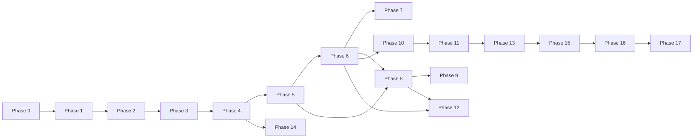

# DM Agree CRM — Implementation Plan

**Status:** Phase 16 complete — next: `EXECUTE PHASE 17`  
**Repository state:** … + Testing  
**Last updated:** 2026-10-02

---

## Table of contents

1. [Decisions required before implementation](#decisions-required-before-implementation)
2. [Phase overview](#phase-overview)
3. [Detailed phases](#detailed-phases)
4. [Testing strategy](#testing-strategy)
5. [Documentation deliverables](#documentation-deliverables)
6. [Major risks](#major-risks)
7. [Dependencies between phases](#dependencies-between-phases)

---

## Decisions required before implementation

The following items are **ambiguous or business-specific**. Implementation must not proceed on assumed answers without your approval.

| # | Topic | Options / question | Recommendation |
|---|--------|-------------------|----------------|
| D1 | **Customer type values** | Fixed enum vs configurable list | Fixed enum in DB + UI (`farmer`, `dealer`, `distributor`, `other`) unless you need admin-configurable types |
| D2 | **Mobile normalization (India)** | 10-digit only vs store country code | Strip non-digits; if 10 digits, prepend `91`; UNIQUE on normalized value |
| D3 | **Inquiry denormalization** | Snapshot name/mobile/product on inquiry vs live join only | **Snapshots on insert** for accurate historical exports if master data changes |
| D4 | **Customer delete** | Soft delete only vs hard delete for GDPR | **Soft delete** (`deleted_at`); inquiries remain linked |
| D5 | **Assigned user default** | Default to creator vs nullable | Default `assigned_user_id` = creator on inquiries/reminders; editable |
| D6 | **Password reset UX** | Email link only vs admin-set temp password | Email self-service reset + admin “send reset link” |
| D7 | **Rate limiting** | None vs Upstash/Vercel middleware | Add on `/login` and import endpoints before prod |
| D8 | **Error monitoring** | Vercel only vs Sentry | Sentry for production (optional budget) |
| D9 | **Excel import staging** | Session memory vs DB staging tables | **DB staging** (`import_batches`) for audit and large files |
| D10 | **Global search** | Top bar search across modules in v1 | Defer to post-MVP or search customers + inquiries only |
| D11 | **Snooze durations** | Presets (1h, 1d) vs custom datetime | Presets + custom datetime picker |
| D12 | **Last admin definition** | Users with Administrator role vs `user.*` permissions | Users with role where role has all `user.*` and `role.*` |
| D13 | **Handwritten UI reference** | Confirm attachment available in repo | Please add image/PDF to `docs/reference/` for Phase 1 UI parity |
| D14 | **Multi-product per inquiry** | Single product per inquiry vs multiple | **Single product per inquiry** (matches requirements); multiple purchases via multiple inquiries or purchase table |
| D15 | **Follow-up required flag** | Manual on customer vs derived from open follow-ups | **Manual flag** on customer + dashboard filter; optional future automation |

---

## Phase overview

| Phase | Name | Depends on |
|-------|------|------------|
| 0 | Project inspection & architecture | — |
| 1 | Project foundation | 0 |
| 2 | Supabase setup | 1 |
| 3 | Authentication | 2 |
| 4 | Roles & permissions | 3 |
| 5 | Products | 4 |
| 6 | Customers | 5 |
| 7 | Customer 360° | 6 |
| 8 | Inquiries | 6, 5 |
| 9 | Follow-ups | 6, 8 |
| 10 | Reminders | 6, 9 |
| 11 | Notifications | 10 |
| 12 | Excel import/export | 6, 8 |
| 13 | Dashboard | 5–11 (incremental) |
| 14 | Activity logs | 4+ (wire with each module) |
| 15 | Security hardening | 4+ |
| 16 | Testing | All feature phases |
| 17 | Production deployment | 15, 16 |

**Note:** Activity logging (Phase 14) should be **integrated incrementally** as each module ships, with Phase 14 dedicated to audit UI and completeness.

---

## Detailed phases

### PHASE 0 — Project inspection and architecture

**Objective:** Confirm scope, document architecture, agree on decisions.

**Dependencies:** None.

**Repository findings:** Workspace is empty; greenfield Next.js project.

**Deliverables:**

- `docs/ARCHITECTURE.md`
- `docs/DATABASE_DESIGN.md`
- `docs/RBAC_DESIGN.md`
- `docs/CUSTOMER_360_DESIGN.md`
- `docs/DEPLOYMENT_PLAN.md`
- `docs/IMPLEMENTATION_PLAN.md` (this file)

**Database / UI / backend changes:** None.

**Security:** Threat model documented in ARCHITECTURE.md.

**Testing:** N/A.

**Acceptance criteria:**

- Stakeholder review of DECISIONS table
- Approval to proceed to Phase 1

**Risks:** Unresolved D1–D15 cause rework mid-build.

---

### PHASE 1 — Project foundation ✅ COMPLETE

**Objective:** Initialize production-grade Next.js App Router project with tooling and shell layout (no business modules).

**Dependencies:** Phase 0 approval.

**Completed:** Next.js 16 + TypeScript + Tailwind v4 + shadcn/ui + Lucide; AppShell sidebar/topbar; module route placeholders; `.env.example`; `npm run build` passes.

**Expected files:**

- `package.json`, `tsconfig.json`, `next.config.ts`, `tailwind.config.ts`, `postcss.config.js`
- `src/app/layout.tsx`, `src/app/page.tsx` (redirect placeholder)
- `src/components/ui/*` (shadcn init)
- `src/components/layout/app-shell.tsx` (static nav placeholders)
- `.env.example`, `.gitignore`, `eslint.config.mjs`
- `README.md` (setup skeleton)

**Database changes:** None.

**UI changes:** Sidebar + topbar scaffold; responsive grid; theme tokens.

**Backend changes:** None.

**Security:** Strict env validation stub; no secrets in repo.

**Testing:** Smoke — app builds and renders shell.

**Acceptance criteria:**

- `pnpm build` succeeds
- Tailwind + shadcn + Lucide working
- Folder structure matches ARCHITECTURE.md

**Risks:** Wrong App Router conventions; fix early.

---

### PHASE 2 — Supabase setup ✅ COMPLETE

**Objective:** Connect Supabase; migrations for core schema skeleton; type generation.

**Dependencies:** Phase 1.

**Completed:** `@supabase/ssr` + JS clients (browser/server/admin); middleware session refresh; full initial migration + RLS + storage bucket; seed (permissions + 3 roles); typed `database.types.ts`; `/api/health/supabase`; setup docs. Apply SQL on your remote project if not already pushed.

**Expected files:**

- `src/lib/supabase/client.ts`, `server.ts`, `admin.ts`, `middleware.ts`
- `supabase/migrations/0001_initial_schema.sql`
- `supabase/seed.sql`
- `src/types/database.types.ts` (generated)

**Database changes:**

- Extensions (`pg_trgm` if approved)
- Tables: permissions, roles, role_permissions, profiles, products, customers, inquiries, followups, reminders, notifications, activity_logs, customer_notes, customer_product_purchases, attachments (optional)
- RLS enabled; baseline authenticated policies
- Indexes per DATABASE_DESIGN.md

**UI changes:** None.

**Backend changes:** Supabase clients; connection health check route (dev only, optional).

**Security:** Service role server-only; verify RLS on all tables.

**Testing:** Migration applies cleanly on empty DB; types match schema.

**Acceptance criteria:**

- Local/dev project linked
- Seed inserts permissions + Administrator role

**Risks:** Migration drift between envs — use single source in `supabase/migrations`.

---

### PHASE 3 — Authentication ✅ COMPLETE

**Objective:** Email/password login, logout, session, protected routes, inactive user block, password reset.

**Dependencies:** Phase 2.

**Completed:** Login / forgot / update-password UI; auth callback; server actions; middleware route guards; protected `(app)` layout with active-profile checks; profile page; logout in topbar.

**Expected files:**

- `src/app/(auth)/login/page.tsx`
- `src/app/auth/callback/route.ts`
- `src/app/(auth)/reset-password/page.tsx`
- `middleware.ts` (session refresh + route guard)
- `src/lib/auth/session.ts`, `get-profile.ts`
- `src/app/(app)/layout.tsx` (protected shell)

**Database changes:** Optional trigger on auth.user created → profile (prefer explicit admin create).

**UI changes:** Login form (RHF + Zod), error states, loading.

**Backend changes:** Server-side sign-in/out helpers; post-login active check.

**Security:**

- No passwords in profiles
- Secure cookies via `@supabase/ssr`
- Redirect open redirect validation

**Testing:**

- Login success/failure
- Inactive user rejected
- Unauthenticated → redirect to login

**Acceptance criteria:**

- Only authenticated active users reach `(app)` routes
- Password reset email flow works in dev Supabase

**Risks:** Misconfigured redirect URLs in Supabase dashboard.

---

### PHASE 4 — Roles and permissions ✅ COMPLETE

**Objective:** RBAC CRUD, permission seed, server `authorize()`, UI gates.

**Dependencies:** Phase 3.

**Completed:** Permission catalog helpers; `authorize` / `authorizeAny`; permissions provider + `<Can>`; roles list/detail CRUD with checkbox matrix; nav filtering; page-level 403 for missing view permissions; last-admin / system-role / in-use protections.

**Expected files:**

- `src/lib/rbac/permissions.ts`, `authorize.ts`, `get-permissions.ts`
- `src/features/roles/*`, `src/actions/roles.ts`
- `src/app/(app)/roles/page.tsx`
- `src/components/shared/can.tsx`
- Nav filtering by permission

**Database changes:** Seed all permission codes; role_permissions UI mutations.

**UI changes:** Roles list, role form with grouped checkboxes, select all, module select all, permission count.

**Backend changes:** All future actions use `authorize`.

**Security:**

- Last admin protection
- System role delete blocked
- Role in-use delete blocked

**Testing:** Authorization unit tests; forbidden access scenarios.

**Acceptance criteria:**

- Administrator sees all modules
- Custom role with subset hides nav and blocks server actions

**Risks:** Forgetting to guard a new action — maintain checklist in PR template.

---

### PHASE 5 — Products ✅ COMPLETE

**Objective:** Product CRUD, active/inactive, safeguards on delete.

**Dependencies:** Phase 4.

**Completed:** Products list with search/status filters + pagination; create/edit dialogs; activate/deactivate; soft delete blocked when referenced; `listActiveProducts()` helper for later pickers.

**Expected files:**

- `src/features/products/*`, `src/actions/products.ts`
- `src/validations/product.ts`
- `src/app/(app)/products/page.tsx`

**Database changes:** None if Phase 2 complete.

**UI changes:** Table, filters, activate/deactivate, delete confirmation.

**Backend changes:** Soft delete; block delete if referenced (or soft only).

**Security:** `product.*` permissions.

**Testing:** CRUD; inactive hidden from pickers (when pickers exist in Phase 6/8).

**Acceptance criteria:**

- Only active products in create dropdowns (Phases 6/8)
- Historical references intact when deactivated

**Risks:** None significant.

---

### PHASE 6 — Customers ✅ COMPLETE

**Objective:** Customer CRUD, search/filter/pagination, duplicate mobile detection.

**Dependencies:** Phase 5.

**Completed:** Customers list with search/product/purchased/follow-up filters + pagination; create/edit with duplicate mobile warning (update existing / open existing); soft delete; `normalizeMobile`; basic detail page at `/customers/[id]` (360 expands in Phase 7).

**Expected files:**

- `src/features/customers/*`, `src/actions/customers.ts`
- `src/lib/customers/normalize-mobile.ts`
- `src/app/(app)/customers/page.tsx`

**Database changes:** Ensure unique index on `mobile_normalized`.

**UI changes:** List page, create/edit modal, duplicate warning flow.

**Backend changes:** Server-side search (trgm or ILIKE), filters, pagination.

**Security:** `customer.*` permissions.

**Testing:** Duplicate detection; filter combinations.

**Acceptance criteria:**

- Cannot silently create duplicate active mobile
- Search performs on server with pagination

**Risks:** Wrong mobile normalization (D2).

---

### PHASE 7 — Customer 360° ✅ COMPLETE

**Objective:** Full `/customers/[customerId]` experience per CUSTOMER_360_DESIGN.md.

**Dependencies:** Phase 6 (minimum); enriched when 8–10 complete.

**Completed:** Parallel `getCustomer360` loader; header quick actions (inquiry/follow-up/reminder/edit/call/copy); sections for profile, inquiries, purchases, follow-ups, reminders (IST status groups), notes, activity timeline; activity logging on customer/360 mutations.

**Expected files:**

- `src/app/(app)/customers/[customerId]/page.tsx`
- `src/features/customer-360/*`
- `src/lib/db/customer-360.ts`

**Database changes:** None if schema complete; ensure activity_logs.customer_id populated going forward.

**UI changes:** Header, sections, quick actions, responsive accordions.

**Backend changes:** Orchestrated parallel queries.

**Security:** `customer.view` + action-level permissions on buttons.

**Testing:** Customer with 10+ follow-ups; empty sections; 403 without permission.

**Acceptance criteria:**

- All section acceptance criteria in CUSTOMER_360_DESIGN.md
- Links from customer list work

**Risks:** Performance without indexes — verify query plans.

---

### PHASE 8 — Inquiries ✅ COMPLETE

**Objective:** Inquiry CRUD, filters, link customer/product, purchased flag, duplicate import hooks.

**Dependencies:** Phases 5, 6.

**Completed:** Inquiries list with date/type/product/purchased/search filters + pagination; create/edit/delete; detail sheet; purchase sync to `customer_product_purchases`; shared `createInquiryRecord` used by Customer 360; Excel import column hooks stub for Phase 12.

**Expected files:**

- `src/features/inquiries/*`, `src/actions/inquiries.ts`
- `src/validations/inquiry.ts`
- `src/app/(app)/inquiries/page.tsx`

**Database changes:** Optional snapshot columns (D3).

**UI changes:** List, filters (date, type, product, purchased), detail drawer.

**Backend changes:** Upsert purchase row when purchased=true; activity log.

**Security:** `inquiry.*` permissions.

**Testing:** Filters; customer FK integrity; purchased sync.

**Acceptance criteria:**

- Every inquiry has valid customer_id and product_id
- Customer 360 inquiry section populated

**Risks:** Orphan inquiries if customer deleted — soft delete preserves FK.

---

### PHASE 9 — Follow-ups ✅ COMPLETE

**Objective:** Append-only follow-up records, list filters, link from inquiries/customers.

**Dependencies:** Phases 6, 8.

**Completed:** Global follow-ups list with search/date/customer/inquiry-link filters + pagination; create/edit/soft-delete; detail sheet; shared `createFollowupRecord` (clears `follow_up_required`); add from Follow-ups page, Customer 360, and Inquiries table; UX copy clarifies append-only history.

**Expected files:**

- `src/features/follow-ups/*`, `src/actions/followups.ts`
- `src/app/(app)/follow-ups/page.tsx`

**UI changes:** Global follow-ups list; add from inquiry/customer/360.

**Backend changes:** Insert-only policy culturally enforced in UI; update permission optional.

**Security:** `followup.*`.

**Testing:** Multiple follow-ups per customer; ordering.

**Acceptance criteria:**

- New follow-up always new row
- 360 history shows chronological data

**Risks:** Users expecting single “last follow-up” field — UX copy must clarify history.

---

### PHASE 10 — Reminders ✅ COMPLETE

**Objective:** Reminder CRUD, complete/reopen/snooze, status filters (IST).

**Dependencies:** Phase 6; optional inquiry link from Phase 8.

**Completed:** Global reminders list with IST status/assignee/customer/date filters + pagination; create/edit/soft-delete; complete/reopen/snooze (updates `snoozed_until` + `remind_at`); status badges; shared `createReminderRecord` + IST helpers (`parseIstDateTimeLocal`, snooze-aware `getReminderUiStatus`); cron-ready `listDueOpenReminders`; Customer 360 create/complete reuses shared helpers.

**Expected files:**

- `src/features/reminders/*`, `src/actions/reminders.ts`
- `src/lib/datetime/ist.ts`
- `src/app/(app)/reminders/page.tsx`

**UI changes:** Status badges, snooze UI, assigned user filter.

**Backend changes:** Status computation helpers; cron-ready queries.

**Security:** `reminder.*`; users see reminders per business rule (all vs assigned only — **decision:** default all with `reminder.view`; filter by assignee).

**Testing:** Overdue/today/upcoming boundaries in IST.

**Acceptance criteria:**

- Snooze updates `snoozed_until`
- Complete sets `completed_at`

**Risks:** Timezone bugs — centralize IST helpers.

---

### PHASE 11 — Notifications ✅ COMPLETE

**Objective:** Bell UI, unread count, dropdown, mark read, cron-generated reminder notifications without duplicates.

**Dependencies:** Phase 10.

**Completed:** Topbar notification bell with unread badge + dropdown; mark one / mark all read; hourly cron `GET /api/cron/reminders` (Bearer `CRON_SECRET` or `?secret=` for local); idempotent inserts via unique `dedupe_key` (`reminder:{id}:today|overdue:{IST-date}`); `vercel.json` cron; scoped to assignee `user_id` via RLS.

**Expected files:**

- `src/features/notifications/*`
- `src/app/api/cron/reminders/route.ts`
- `vercel.json` cron entry
- `src/components/layout/notification-bell.tsx`

**Database changes:** `notifications.dedupe_key` unique enforced.

**UI changes:** Bell, dropdown lists, mark all read.

**Backend changes:** Cron idempotent insert; optional Realtime subscription.

**Security:** CRON_SECRET; notifications scoped to `user_id`.

**Testing:** Reminder notification not duplicated on second cron run.

**Acceptance criteria:**

- Unread count accurate
- Today/overdue reminders appear as notifications

**Risks:** Cron not running on non-Vercel dev — manual trigger route for testing.

---

### PHASE 12 — Excel import/export ✅ COMPLETE

**Objective:** Reusable ExcelJS utilities; inquiries + customers import/export.

**Dependencies:** Phases 6, 8.

**Completed:** ExcelJS templates + parse/validate; DB-staged `import_batches` wizard (upload → preview/errors → confirm); duplicate mobile skip/update; inquiry import find-or-create customer + product name lookup; filtered export routes; `inquiry|customer.import/export` gated UI.

**Expected files:**

- `src/lib/excel/*`
- `src/features/import/*` (shared wizard)
- Actions/routes for template, parse, commit, export

**Database changes:** Optional `import_batches` tables (D9).

**UI changes:** Multi-step wizard: upload → preview → errors → confirm.

**Backend changes:** Row validation; duplicate mobile handling; transactional commit.

**Security:** `*.import` / `*.export` permissions; file type/size limits.

**Testing:** Invalid rows; partial import; duplicate mobile; export matches filters.

**Acceptance criteria:**

- Template download works
- Import summary shows counts
- Export respects active filters

**Risks:** Memory on large files — stream where possible; row limits.

---

### PHASE 13 — Dashboard ✅ COMPLETE

**Objective:** Summary cards, charts (Recharts), widgets from DB.

**Dependencies:** Modules 5–11 data available (can ship incremental widgets).

**Completed:** Parallel aggregate loader `getDashboardData`; summary cards (customers, follow-up required, inquiries, my inquiries, follow-ups, reminder buckets, products, unread); Recharts bar/pie charts (14-day inquiries, type mix, purchase split) with empty states; recent inquiries + overdue/today reminder widgets.

**Expected files:**

- `src/features/dashboard/*`
- `src/lib/db/dashboard.ts`
- `src/app/(app)/dashboard/page.tsx`

**UI changes:** Cards, charts, recent lists, reminder widgets.

**Backend changes:** Aggregations SQL; avoid N+1.

**Security:** `dashboard.view`.

**Testing:** Counts match seeded/integration data.

**Acceptance criteria:**

- All metrics from database, not hardcoded
- Charts render with empty data gracefully

**Risks:** Heavy queries — use SQL aggregates and caching (revalidate tag) if needed.

---

### PHASE 14 — Activity logs ✅ COMPLETE

**Objective:** Consistent logging + optional global activity view; 360 timeline complete.

**Dependencies:** Modules emitting logs.

**Completed:** Global `/activity` (gated by `activity.view`) with module/action/actor/date/search filters + pagination; shared action labels; audit pass — products & roles now log; `PRODUCT_PURCHASED` on inquiry purchase create/update; Excel import actions in typed union; 360 timeline uses shared labels.

**Expected files:**

- `src/lib/activity/log.ts`
- `src/app/(app)/activity/page.tsx` (if `activity.view`)

**Database changes:** None if table exists.

**UI changes:** Global activity list with filters.

**Backend changes:** Backfill logging in all actions (audit pass).

**Security:** `activity.view` for global page; 360 uses customer-scoped logs.

**Testing:** Each action type creates log with correct metadata.

**Acceptance criteria:**

- 360 timeline shows create/update events for test customer

**Risks:** Missing logs on edge paths — checklist per module.

---

### PHASE 15 — Security hardening ✅ COMPLETE

**Objective:** RLS fine-tuning, rate limits, upload validation, CSRF review, dependency audit.

**Dependencies:** Feature-complete beta.

**Completed:** Migration `20261002140000_phase15_rls_hardening.sql` (`app_has_permission`, roles/notifications/activity/import/profile policies); login + import rate limits (D7); xlsx magic-byte upload validation; import batch ownership checks; cron middleware exemption + prod Bearer-only cron auth; `docs/SECURITY.md`; `npm run audit` script.

**Expected files:**

- RLS policy migrations
- Rate limit middleware (if D7 approved)
- `docs/SECURITY.md` (optional)

**Testing:** Pen-test scenarios from testing plan; OWASP spot checks.

**Acceptance criteria:**

- Direct Supabase client cannot bypass RBAC for anon users
- Import/upload rejects malicious payloads

**Risks:** Over-restrictive RLS breaking app — test with user JWT client.

---

### PHASE 16 — Testing ✅ COMPLETE

**Objective:** Automated test suite + manual QA scripts.

**Dependencies:** Features implemented.

**Completed:** Vitest unit suite (`normalizeMobile`, IST reminder boundaries, `hasPermission`, Excel validate / upload / rate-limit); `docs/QA_CHECKLIST.md` for manual scenarios 1–14 with documented exceptions; GitHub Actions CI (lint + test + build). Playwright E2E deferred (optional).

**Expected files:**

- `vitest.config.ts`, `tests/**/*`
- CI workflow (GitHub Actions)

**Coverage targets:**

- RBAC authorize helpers (unit)
- Mobile normalization (unit)
- IST reminder boundaries (unit)
- Server actions integration (test DB or Supabase local)
- E2E optional (Playwright) for login + one CRUD path

**Acceptance criteria:**

- All scenarios in [Testing strategy](#testing-strategy) pass or documented exceptions

**Risks:** Flaky E2E — prioritize integration tests on server actions.

---

### PHASE 17 — Production deployment

**Objective:** Prod Supabase + Vercel live per DEPLOYMENT_PLAN.md.

**Dependencies:** Phases 15–16.

**Tasks:**

- Prod env vars
- Migrations on prod
- Bootstrap admin
- Cron verified
- Domain + SSL
- Smoke test checklist

**Acceptance criteria:**

- Employees can log in and perform role-appropriate work
- No service role in client bundle (verify build output)
- Cron creates notifications once per dedupe key

**Risks:** Production auth redirect misconfiguration.

---

## Testing strategy

### Layers

| Layer | Scope | Tools |
|-------|--------|-------|
| Unit | normalize-mobile, IST dates, authorize logic | Vitest |
| Integration | Server Actions + Supabase test project | Vitest + test DB |
| E2E | Login, CRUD smoke, 360 load | Playwright (optional) |
| Manual | Mobile responsive, Excel edge files | QA checklist |

### Required scenarios (from requirements)

1. Employee without permission → Customers blocked (UI + server action).
2. Direct call to protected server action → forbidden.
3. Inactive user → cannot use app.
4. Duplicate mobile on import → warning/merge/skip; no silent duplicate.
5. Customer with 10+ follow-ups → 360 displays correctly.
6. Reminder becomes overdue → status + notification (after Phase 11).
7. Notification not duplicated on second cron run.
8. Product inactive → hidden from new inquiry; old records valid.
9. Last administrator delete/demote → blocked.
10. User cannot modify another user's records without permission (if record-level rules added).
11. Excel invalid rows → reported by row.
12. Multiple inquiries per customer → all listed.
13. Multiple purchased products → purchase section complete.
14. Customer 360 loads full history within performance target.

### Non-functional

- Mobile layout usable for list + 360 accordion
- Error boundaries on segment routes
- Loading skeletons on slow queries

---

## Documentation deliverables

| File | When |
|------|------|
| `README.md` | Phase 1 expanded through Phase 17 |
| `docs/ARCHITECTURE.md` | Phase 0 ✓ |
| `docs/DATABASE.md` | Alias or merge of DATABASE_DESIGN.md (optional rename) |
| `docs/RBAC.md` | Alias of RBAC_DESIGN.md (optional) |
| `docs/DEPLOYMENT.md` | Alias of DEPLOYMENT_PLAN.md (optional) |
| `.env.example` | Phase 1 |

---

## Major risks

| Risk | Impact | Mitigation |
|------|--------|------------|
| RBAC gaps on new endpoints | High | PR checklist; centralized `authorize` |
| IST/timezone errors | Medium | Single datetime module; tests |
| Excel large files | Medium | Row limits; streaming; staging tables |
| Duplicate customers | Medium | UNIQUE mobile_normalized + import UX |
| Service role leakage | Critical | Code review; no NEXT_PUBLIC; eslint import rules |
| Cron duplicate notifications | Medium | dedupe_key unique |
| Customer 360 perf | Medium | Parallel queries; indexes; pagination |
| Empty repo → big bang merge | Medium | Strict phase gates and acceptance criteria |
| Unapproved D1–D15 | High | Stakeholder sign-off on decisions table |

---

## Dependencies between phases

---

## How to start implementation

When you approve decisions and are ready:

> **EXECUTE PHASE 1**

Do not begin coding before that explicit instruction.
